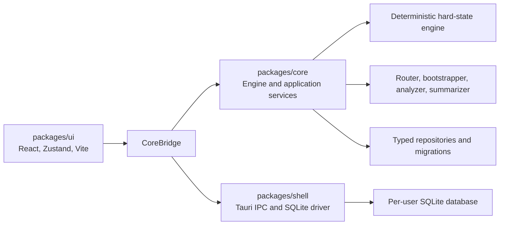

# Midnight Tavern Project Status Audit

**Audit date:** 22 July 2026  
**Repository:** `midnight-tavern-app`  
**Branch:** `main` (`28` commits ahead of `origin/main`)  
**Overall condition:** Advanced alpha. The core product architecture is strong and the principal data-integrity blockers have been repaired, but the import journey, complete model configuration UX, desktop acceptance testing, and release pipeline are unfinished.

## Executive assessment

Midnight Tavern is a real, substantial application rather than a prototype shell. It has a deterministic role-playing engine, typed persistence, model routing, bootstrap and memory systems, a broad React interface, and a compiling Tauri desktop host. The project consistently implements its central design rule: program-owned mechanics are authoritative, while models provide prose, classification, and soft narrative memory.

The local branch is materially healthier than the previous audit snapshot. Four recent commits repaired the largest known blockers:

- the Tauri UI now initializes SQLite before React mounts and fails visibly instead of silently falling back to memory;
- swipe now reruns the analyzer per prose variant, variant selection restores matching soft/world state, delete and rewind are atomic, and derived summaries are invalidated;
- Overview now reads persisted chapters and arcs through the bridge;
- stale V2 role-binding test doubles were updated, restoring the declared typecheck gate.

The interrupted Claude Code edit was a Role Matrix JSON-risk warning. During takeover, that edit was completed, its incorrect model-capability values were reconciled with the canonical catalog, and a dedicated UI test was added. A remaining failed-swipe rollback hole was also found and fixed: if narration or analysis fails after restoring the turn pre-image, the active variant's soft/world state is now restored and the message remains unchanged.

The project is not yet beta- or release-ready. A user still cannot confirm an imported card into a playable story, the Role Matrix does not implement the full provider/model/live-list/free-text contract, and formal live-model and long-run acceptance exercises are absent. The application executable compiles, but Windows installer bundling is currently blocked by the local proxy certificate while Tauri downloads WiX; signing and updater configuration also remain placeholders.

## Current status at a glance

| Area | Condition | Observation |
|---|---|---|
| Product architecture | Strong | Clear hard/soft-state boundary and local-first design |
| Mechanics engine | Strong | 100% engine coverage and deterministic 50-turn playthrough |
| Core services | Strong alpha | Router, bootstrapper, analyzer, summaries, importer, licensing, persistence, and V2 history exist |
| React UI | Broad, incomplete | Fourteen product routes; main gaps are import confirmation and complete model configuration |
| Desktop persistence | Implemented, needs smoke test | Tauri selects SQLite before mount; restart persistence has not been manually demonstrated |
| History integrity | Repaired | Analyzer-per-variant, exact state selection, atomic delete/rewind, summary invalidation, and failed-swipe rollback |
| Overview | Connected | Reads persisted chapters/arcs; derives only the still-open transcript tail |
| Automated tests | Green | 393 tests after takeover: 311 core and 82 UI |
| Type safety | Green | Root workspace typecheck passes |
| Production builds | Green through executable | Core, UI, Rust check, and release `.exe` compilation pass |
| Installer bundle | Environment-blocked | WiX download fails through the proxy with TLS `UnknownIssuer` |
| Release readiness | Red | Signing, notarization, updater keys/host, CSP, installers, and update validation remain incomplete |
| Version control | Local work in progress | Branch is 28 commits ahead; takeover changes and this audit are intentionally uncommitted |

## Repository and architecture map

The final refreshed code knowledge graph contains 2,449 nodes and 5,765 relationships. Its inventory includes 136 TypeScript/TSX files, 28 HTML design prototypes, four Rust files, two CSS files, two JavaScript files, and one TOML manifest. The repository is organized into three runtime workspaces:

The graph's main hotspots are expected façade functions rather than unexplained coupling: `store.db.run`, UI `getBridge`, and story-loading helpers have high fan-in because they are shared boundaries. The project has coherent clusters for execution/orchestration, persistence, model routing, and UI bridge/state.

### Core capabilities present

- Frozen story schemas and typed records
- Deterministic d20 dice, gates, resolution, resources, death, mastery, and unlocks
- Hard-state ledger and authority-last commit ordering
- Typed SQLite repositories and migrations
- Provider registry and OpenAI-compatible adapters
- Structured-output validation and repair
- Five-role routing with per-role samplers
- Two-phase story bootstrap and schema freezing
- Mechanical classifier and turn orchestration
- Character/world soft-state analyzer
- Living-card and character-dossier projections
- Chapter and arc summarization
- Chara Card V2/V3 JSON, PNG, and URL parsing
- Licensing, trial, persona, lorebook, blueprint, checkpoint, and variant data

### Product routes present

1. Library
2. Play
3. Overview
4. Characters
5. Character Dossier
6. Story Settings
7. Story Blueprint
8. Settings
9. Role Matrix
10. Personas
11. Card Creator/import preview
12. Lorebook
13. Wizard
14. Design System

The V2 handoff contains fifteen prototype screens because its Index is a design-review directory rather than a product route.

## Changes already completed before and during takeover

### SQLite startup is now real

`packages/ui/src/main.tsx` detects Tauri, awaits `initBridge({ backend: "sqlite" })`, and mounts React only after initialization succeeds. Browser development and tests still select the in-memory backend deliberately. A SQLite failure renders an actionable startup screen and never silently degrades to ephemeral data.

The UI build also keeps native Node dependencies out of the webview bundle. The previous `better-sqlite3` browser externalization warnings are no longer emitted by the current build.

Remaining evidence gap: a packaged create/close/reopen/read persistence smoke test has not been run in this audit.

### History integrity is substantially complete

The V2 history implementation now:

- retains hard state and rulings while generating alternate narrator prose;
- restores the turn's soft/world pre-image before each swipe;
- reruns the analyzer on the new prose;
- stores per-variant post-analyzer soft/world snapshots;
- reapplies the matching snapshot when the user selects an older variant;
- restores the still-active state if narration, analysis, or variant persistence fails;
- persists a new message variant and its state array atomically;
- restores and truncates delete/rewind operations inside one transaction;
- removes characters/world state created after a checkpoint;
- deletes chapters/arcs derived from removed messages.

The takeover added the missing failed-swipe regression test. This closes the known P0 history-state corruption path.

### Overview reads persisted summaries

`CoreBridge` now exposes `listChapters` and `listArcs` in both backends. Overview loads messages, chapters, and arcs together, renders persisted chapter summaries and the latest persisted arc document, and derives only the open tail after the last summarized message.

### Role Matrix JSON-risk guardrail is complete

Classifier, Analyzer, and Story AI now display a non-blocking warning when their selected known model lacks JSON mode. Narrator and Summarizer do not show that structured-output warning.

The interrupted edit initially marked three models inconsistently with `modelCatalog.ts` and used an invalid notice severity. The takeover corrected both the static core list and its browser mirror, made `supportsJsonMode` required for curated models, stopped the memory recommendation bridge from hard-coding every model as JSON-safe, and added a dedicated Role Matrix test.

## Verification performed

| Check | Result |
|---|---|
| Root `npm test` | Passed |
| Core tests | 311 passed across 21 files |
| UI tests | 82 passed across 16 files |
| Total tests | 393 passed |
| Root `npm run typecheck` | Passed |
| Core production build | Passed |
| UI TypeScript + Vite production build | Passed; 186 modules transformed |
| Rust `cargo check` | Passed |
| Engine coverage | 100% statements, branches, functions, and lines |
| 50-turn deterministic playthrough | Passed as part of core tests |
| Release executable compilation | Passed: `packages/shell/src-tauri/target/release/midnight-tavern.exe` |
| Windows installer bundle | Failed during WiX download because proxy TLS certificate is `UnknownIssuer` |
| `git diff --check` | Passed after takeover formatting cleanup |

### Installer failure classification

The Tauri release build completed Rust optimization and produced the application executable. It then attempted to fetch `wix314-binaries.zip` from GitHub and failed TLS certificate initialization with `UnknownIssuer`.

This is an environment/proxy trust failure, not an application compile failure. The safe resolution is to install/trust the proxy's root CA for the process/toolchain or pre-seed the required WiX tool cache from a trusted network. TLS verification should not be disabled.

## Remaining product gaps

### 1. Card import stops at preview

**Priority:** Highest remaining product journey

The importer and preview are implemented. Card Creator reads a file or URL, validates it, maps identity/premise/openings/lorebook data, and renders warnings and provenance. However:

- Library's Import affordance does not enter a complete import-to-story workflow;
- `Use this card` has no click handler;
- mapped card data is not handed to Wizard or a dedicated create-story command;
- openings, blueprint identity, and lorebook seeds are not persisted into the new story;
- there is no end-to-end UI test proving an imported V2/V3 card becomes playable.

This keeps formal product-shell acceptance incomplete.

### 2. The full Role Matrix contract is still partial

The JSON warning is now implemented, but the design and V2 plan require more:

- separate provider and provider-scoped model selectors;
- provider live-model listing when available;
- bundled catalog fallback when live listing is unavailable;
- persistent free-text model IDs;
- role-aware recommendation grouping/badging;
- full sampler surface including repetition penalty, stop sequences, and optional seed;
- disabled unsupported samplers with a reason;
- one canonical source for model metadata and sampler defaults.

The current standalone Role Matrix and the simpler matrix embedded in Settings are also not the same implementation. Browser memory mode mirrors a subset of providers/models manually, while SQLite mode can reach the broader core catalog. That duplication is a continuing drift risk.

### 3. Desktop persistence needs end-to-end proof

The startup wiring defect is fixed in code, but no automated or manual packaged-app test has demonstrated:

1. create a story;
2. close the app;
3. reopen it;
4. read the same story/messages/settings;
5. continue playing.

This should be a beta gate because browser-memory tests cannot prove packaged SQLite behavior.

### 4. Formal live-model acceptance is missing

The repository has strong deterministic and mocked-router tests, but the plans call for evidence that was not found:

- talking-skeleton exercise across three recommended models;
- ten varied premises across three recommended models;
- full `statMode: none` live acceptance;
- a 100-turn memory/summary coherence run;
- clean-profile first-run testing with real provider credentials.

These exercises may require controlled credentials and cost budgets, so they should live in a separate opt-in acceptance harness rather than the default unit suite.

### 5. Release operations are scaffolding

The release guide is detailed, but production configuration is not provisioned:

- Windows certificate thumbprint is `null`;
- Apple signing/notarization credentials are absent;
- updater public key is a placeholder;
- updater endpoint is `updates.example.com`;
- updater artifact signatures/manifests are not produced;
- no Windows/macOS release workflow is present and proven;
- the current machine cannot complete first-time WiX acquisition through its proxy;
- no signed installer or test-manifest update has been validated.

The release guide's claim that Rust cannot run locally is stale: Rust checks and release executable compilation now succeed.

## Quality, security, and maintainability observations

### UI test warnings

The test suite passes, but React reports unwrapped asynchronous updates in Play, Wizard, Story Settings, and Overview tests. These warnings can hide timing errors and make CI output noisy. Role Matrix now has a dedicated screen test; Character Dossier, Story Blueprint, and Design System still lack dedicated screen suites.

### Bridge/catalog duplication

The in-memory bridge intentionally avoids importing the native core graph, but it manually mirrors provider IDs, default role maps, and known models. The audit found real JSON-capability drift in that mirror. A generated browser-safe catalog or shared native-free configuration module would reduce this risk.

### Large UI modules

Play, Lorebook, Character Dossier, Design System, Story Settings, Settings, and the bridge are large modules combining loading, state transitions, persistence calls, and detailed presentation. This is not an immediate correctness defect, but feature-specific hooks and smaller containers will become important as the remaining workflows are completed.

### Security hardening

Positive findings:

- no telemetry was observed;
- model calls use user-supplied credentials;
- story data is intended to remain local;
- startup does not silently replace failed persistence with memory.

Remaining work:

- Tauri CSP is currently `null` and should be least-privilege before release;
- operating-system credential-vault use and encryption at rest were not demonstrated;
- provider/license key storage requires a focused security review before distribution.

### Documentation

The plan/design corpus is unusually thorough and includes architecture, data contracts, milestones, V2 behavior, states, flows, visual rules, prototypes, and release instructions. Operational documentation is weak: the root README contains only the project name, several acceptance checklists are not maintained as evidence, and parts of the release guide no longer reflect the current machine.

## Formal milestone assessment

| Milestone | Assessment | Reason |
|---|---|---|
| A — Engine proven | Achieved | 100% engine coverage and deterministic 50-turn playthrough |
| B — Talking skeleton | Partial | End-to-end mocked flow exists; three live recommended models not demonstrated |
| C — Stories exist | Partial | Bootstrap/freeze/repair are implemented; live premise matrix missing |
| D — Memory lives | Mostly implemented, acceptance incomplete | Analyzer, dossiers, summaries, Overview, and safe history exist; 100-turn run missing |
| E — Product shell | Partial | Broad UI and real SQLite startup exist; import-to-play and restart smoke test missing |
| F — Sellable | Not achieved | Signing, installers, updater, hosted manifest, and licensing operations incomplete |

## V2 phase assessment

| Phase | Assessment | Notes |
|---|---|---|
| 0 — Baseline | Complete locally | Branch is ahead of remote and contains the V2 implementation wave |
| 1 — Model config spine | Partial | Core helpers and JSON warning exist; full UI selection/sampler contract does not |
| 2 — Blueprint/authority | Mostly complete | Blueprint editor/schema and authority-last tests exist |
| 3 — Global lorebooks | Mostly complete | CRUD, attachments, and context integration exist; final UX acceptance remains |
| 4 — Persona attach | Mostly complete | Wizard and Story Settings paths exist |
| 5 — Swipe/delete/rewind | Substantially complete | Required integrity semantics and failure rollback are now covered |
| 6 — Dossier | Mostly complete | Read model and screen exist; dedicated screen coverage is absent |
| 7 — Specimens/final verification | Partial | Specimens/build/tests/typecheck pass; formal live/design acceptance remains |

## Recommended continuation order

1. Complete `Use this card` and the import-to-Wizard/create-story handoff, including persistence of blueprint/openings/lorebook seeds and an end-to-end test.
2. Consolidate Settings and Role Matrix around separate provider/model controls, the canonical catalog, live-list fallback, free text, and the complete sampler surface.
3. Add a packaged SQLite restart smoke test and manually exercise a clean-profile first run.
4. Remove React `act(...)` warnings and add Dossier/Blueprint/Design System screen coverage.
5. Establish an opt-in live-model acceptance harness for the three-model, premise-matrix, and 100-turn requirements.
6. Fix proxy CA trust or pre-seed WiX, then add signed Windows/macOS release automation, updater keys/host, and update validation.
7. Add a strict Tauri CSP and complete credential-storage review.
8. Replace the root README with setup, architecture, development, test, packaging, and troubleshooting instructions.
9. Push/submit the 28 local commits and the takeover changes through the intended review process when the user is ready.

## Suggested internal-beta exit criteria

- A user can create or import a story, play it, close the app, reopen it, and continue.
- Tauri persistence restart behavior is tested.
- Build, typecheck, tests, coverage, and Rust checks stay green in CI.
- Role Matrix implements the complete planned provider/model/sampler workflow.
- No history operation can desynchronize transcript, rulings, hard state, soft/world state, or summaries.
- Live-model bootstrap and long-run memory acceptance evidence exists.
- UI tests run without asynchronous update warnings.

Release readiness additionally requires signed installers for Windows and macOS, a real update host and keypair, a successful test update, a strict CSP, and removal of all placeholder release configuration.

## Audit limitations

- No external model-provider calls were made.
- The packaged Tauri GUI was not manually exercised.
- Windows installer bundling was stopped by proxy certificate trust while downloading WiX.
- macOS signing/notarization cannot be validated on this Windows host.
- No pixel-by-pixel comparison against every prototype state was performed.
- Credential-vault and encryption-at-rest controls were not audited.
- This document describes the local worktree, including uncommitted takeover fixes, not only `HEAD`.
