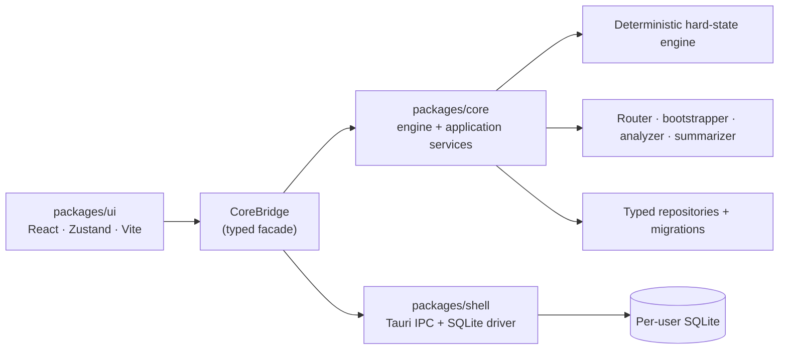

<div align="center">

# Midnight Tavern

**A local-first AI roleplay application where the game mechanics are enforced by deterministic code — not by the AI.**

Dice, skills, inventory, and health are computed by a program the language model cannot influence, so failure genuinely happens and the world can genuinely refuse the player. The AI writes the prose; the engine owns the truth.

TypeScript · React · Tauri · SQLite · Zod

</div>

---

## Table of contents

- [What it is](#what-it-is)
- [Why it's different](#why-its-different)
- [The core idea: the hard/soft wall](#the-core-idea-the-hardsoft-wall)
- [How a turn works](#how-a-turn-works)
- [Feature overview](#feature-overview)
- [Architecture](#architecture)
- [Repository layout](#repository-layout)
- [Getting started](#getting-started)
- [Development workflow](#development-workflow)
- [Testing philosophy](#testing-philosophy)
- [Project status](#project-status)
- [Roadmap](#roadmap)
- [Further reading](#further-reading)
- [License](#license)

---

## What it is

Midnight Tavern is a desktop application for playing interactive, AI-narrated roleplay stories — the kind of long-form, character-driven fiction people play in tools like SillyTavern. It runs entirely on the user's own machine and connects to the language-model provider of their choice.

What sets it apart from a normal AI chat frontend is a **deterministic game engine** underneath the story. Most AI roleplay tools ask the model to *pretend* to run rules — to decide whether an attack hits, whether a lockpick succeeds, how much health was lost. Models are unreliable at this: they grant the player things they never earned, forget that a door was locked, and quietly rewrite outcomes to keep the story pleasant. Midnight Tavern removes that responsibility from the model entirely. A real d20 is rolled by code against a difficulty that was fixed when the story was created, the result is binding, and the AI is told to narrate what already happened.

The product is deliberately **local-first**: it hosts nothing, stores everything in a single SQLite database on the user's disk, and sends story content only to the model provider the user configured. Bring a character card, and a playable, rules-enforced story is a few clicks away.

## Why it's different

| | Typical AI roleplay client | Midnight Tavern |
|---|---|---|
| Who decides if an action succeeds | The model, per prompt | **Deterministic engine** (`d20 + modifiers` vs a frozen DC) |
| Who sets difficulty | The model, at runtime | **Pre-assigned once at story creation, then frozen** |
| Who writes health / inventory / skills | The model | **The engine's ledger, and nothing else** |
| Can the world refuse the player? | No | **Yes** — *"Denied — requires Lockpicking (not learned)"* |
| Is the math visible? | Rarely | **Always** — every roll is shown in full and can be verified |
| Long-story coherence | Degrades as context overflows | **Chapters and arcs** compress history into a browsable record |

The one-sentence pitch: *a roleplay where what you do actually matters, because the world has rules that even the AI can't break.*

## The core idea: the hard/soft wall

The entire architecture is organized around one invariant, referred to throughout the codebase as **the wall**:

- **Hard state** — the mechanical ledger: attributes, resources (HP, stamina, …), learned skills and their mastery ranks, inventory, flags, alive/dead. **The engine is the *only* writer.** No model output can ever touch it.
- **Soft state** — the narrative memory: personality, mood, relationships, observations, locations, plot threads. Written by a dedicated *analyzer* model that is **schema-forbidden from emitting any mechanical field.**

The two are stored separately and joined only when rendering a character. This separation is what makes the integrity promise real rather than aspirational: a hallucinated "you gain a legendary sword" in the prose has **no mechanical effect**, because prose is not a path that can write the ledger. The engine computed the outcome before the narrator ever wrote a word.

## How a turn works

```
Player types free text
        │
        ▼
1. Classifier (LLM)   free text → zero or more actions from the frozen Action Catalog
        │             (it physically cannot emit an action that isn't in the catalog)
        ▼
2. Engine             for each action: gate check → d20 roll → outcome table → a Ruling
        │             (computed, NOT yet committed)
        ▼
3. Context assembler  builds the prompt: system frame + authoritative rulings + hard-state
        │             snapshot + memory + recent history, within a token budget
        ▼
4. Narrator (LLM)     streams prose that MUST narrate the already-decided rulings;
        │             an authority clause (always last in the prompt) forbids inventing outcomes
        ▼
5. Commit (atomic)    persist the narrator message; the ledger applies each ruling; rulings saved
        │             — all in one transaction, so a crash can't half-apply a turn
        ▼
6. Async, off the critical path
        ├─ Analyzer     updates soft/narrative memory from the new prose
        └─ Summarizer   rolls messages into chapters, and chapters into arc documents
```

Two ordering details carry real weight and are enforced by tests:

1. **Rulings are computed *before* the narrator writes** (so the prose always reflects decided truth) but **committed *after* it returns** (so a failed generation never leaves state mutated with no story to show for it).
2. **The framework's authority clause is always the last thing in the narrator prompt**, positioned after any user-authored system prompt, so user prompts can shape *voice* but never override *mechanics*.

## Feature overview

**Deterministic engine**
- d20 resolution with attribute + skill-mastery modifiers, critical success/failure, and opposed contests
- **Gating**: actions can require a learned skill, a mastery rank, an item, a resource level, or a story flag — and are refused by code when unmet
- **Attributes** (STR/DEX/… — generated per story, not a fixed set) feeding a centralized score→modifier function
- **Skill mastery**: binary unlock plus Novice → Adept → Expert → Master ranks that advance deterministically after N successes
- **Advantage / disadvantage** derived from frozen schema conditions (never model-assigned)
- **Difficulty** as a transparent, bounded, player-chosen DC-and-damage adjustment, shown in every ruling
- Full outcome tables (self/target resource deltas, item grants, flag sets) applied only by the ledger, with clamping and death handling

**World generation & content**
- **Two-phase bootstrapper** turns a premise (or an imported card) into a complete, validated story schema — attributes, resources, skills, items, and an Action Catalog with pre-assigned DCs — then *freezes* it
- Schema validation with an automatic repair loop when a model returns something invalid
- **Story Blueprint** editor with full SillyTavern-equivalent fields (description, personality, scenario, first message, alternate greetings, system prompt, post-history instructions, example dialogue, tags, embedded lorebook)
- **Character card import**: Chara Card V2/V3 from PNG (embedded data), raw JSON, or URL
- **Personas** (who the player is) and **global lorebooks** attachable to any story

**Memory & long-story coherence**
- **Living cards** and a full **character dossier** that evolve through play (identity, mentality, past, dual-direction relationships, and the mechanical sheet)
- **Chapters** (message blocks) compressed into **arc documents** — structured, multi-section summaries the player can browse like a book of their own story
- A **mechanical journal**: an append-only, exportable log of every roll, gate, and milestone — the product's verification artifact

**Model configuration**
- Five independently assignable model roles — **Narrator, Classifier, Analyzer, Summarizer, Story AI** — each with its own provider, model, and sampler profile
- OpenAI-compatible provider layer with a curated, role-aware model catalog and recommended defaults
- Structured-output validation with repair for every JSON-emitting role

**History integrity**
- **Swipe** (regenerate the telling, *never* re-roll the dice — the outcome stands across variants), with optional steering feedback
- **Delete last exchange** and **rewind to here**, implemented against per-turn state checkpoints so hard state, soft state, and derived summaries are restored exactly and atomically

**Platform**
- **Tauri** desktop shell (Rust host, web UI) with a per-user SQLite database
- Merchant-of-record licensing with an offline-tolerant trial

## Architecture

Three workspaces, one strict dependency direction:



Design rules the codebase holds to:

- **`core` never imports from `ui`.** All non-UI logic lives in `core` and is consumed through a single typed façade.
- **Every model-facing boundary is validated with Zod.** Model output is treated as untrusted until it parses.
- **No raw SQL outside `store/repositories/`.** Persistence is typed and centralized; migrations are versioned.
- **`core` stays webview-portable.** The store path avoids Node built-ins so the same logic runs under the Tauri driver and an in-memory test driver.

For the full design — data model, per-turn pipeline, prompt contracts, and the reasoning behind each decision — see **[`ARCHITECTURE.md`](ARCHITECTURE.md)**.

## Repository layout

```
midnight-tavern-app/
├─ packages/
│  ├─ core/              All non-UI logic (see packages/core/README.md)
│  │  └─ src/
│  │     ├─ types/       Frozen schema, hard/soft state, actions, records (Zod + TS)
│  │     ├─ engine/      Dice, gate, resolver, ledger, attributes, difficulty — deterministic
│  │     ├─ classifier/  Free text → Action Catalog
│  │     ├─ bootstrap/   Two-phase story generation, validation, repair, freeze
│  │     ├─ memory/      Analyzer, soft store, living-card & dossier projections
│  │     ├─ summarizer/  Chapters, arc documents, memory injector
│  │     ├─ router/      Providers, role→model routing, sampler profiles, structured output
│  │     ├─ importer/    Chara Card V2/V3 (PNG / JSON / URL)
│  │     ├─ orchestrator/Turn pipeline, context assembly, swipe/delete/rewind, journal
│  │     ├─ macros/      Prompt template engine
│  │     ├─ store/       SQLite driver, migrations, typed repositories
│  │     └─ licensing/   Trial + merchant-of-record license validation
│  ├─ ui/                React desktop UI (see packages/ui/README.md)
│  └─ shell/             Tauri host — Rust IPC + SQLite driver (see packages/shell/README.md)
├─ Plan/                 Product & engineering planning documents (source of record for behavior)
├─ Design/               Versioned design handoffs (visual system, screens, prototypes)
├─ Audit/                Point-in-time status audits
└─ docs/                 Contributor documentation
```

## Getting started

### Prerequisites

- **Node.js ≥ 20** and npm
- **Rust toolchain** (stable) and the [Tauri v2 prerequisites](https://v2.tauri.app/start/prerequisites/) for your OS — only needed to run or build the desktop shell
- A build toolchain for native modules (`better-sqlite3` compiles on install)
- An API key for at least one supported model provider (OpenAI-compatible; OpenRouter is the recommended single-key path)

### Install

```bash
git clone https://github.com/Deathwalker-47/midnight-tavern-app.git
cd midnight-tavern-app
npm install          # installs all workspaces
```

### Run the core test suite (no GUI, no API keys needed)

The fastest way to see the project working is to run the engine and service tests:

```bash
npm test             # runs tests across all workspaces
```

### Run the desktop app

```bash
# from packages/shell — launches the Tauri dev host with the React UI
cd packages/shell
npm run tauri dev
```

On first launch a setup wizard walks through connecting a provider, validating the key with a live test generation, and confirming recommended models for each role. Then create a story from a premise, or import a character card, and play.

> **Note on packaging:** signed installers, auto-update, and notarization are configured but not yet complete (see [Project status](#project-status)). `npm run tauri build` compiles a runnable executable; production-grade signed installers are a remaining task.

## Development workflow

Common commands (run from the repo root unless noted):

```bash
npm run build         # build all workspaces
npm run typecheck     # type-check all workspaces (root gate)
npm test              # test all workspaces

# core package specifically
cd packages/core
npm test              # vitest
npm run coverage      # vitest + V8 coverage (engine is held to 100% branch coverage)
npm run test:watch    # watch mode

# ui package
cd packages/ui
npm run dev           # Vite dev server (UI in a browser, against the in-memory core)
npm test              # React Testing Library + vitest
```

See **[`docs/CONTRIBUTING.md`](docs/CONTRIBUTING.md)** for coding conventions, the bridge/backend contract, and how to add a feature end-to-end.

## Testing philosophy

The engine is the product's credibility, so it is tested accordingly:

- The **mechanics engine is held to 100% branch coverage** with table-driven, seeded-RNG tests — every gate branch, crit rule, opposed contest, mastery advancement, clamp, and death path.
- **Structural validity is guaranteed by construction**: because every model-facing boundary is Zod-validated, a misbehaving model produces a caught error and a repair attempt, never corrupt state.
- **History integrity has dedicated tests**: swipe leaves hard state byte-identical, the authority clause is asserted to be last on every narrator call, and delete/rewind restore state and summaries exactly.

As of 2 August 2026 (HEAD `3566c25`) the suite was green at **792 tests** (632 core, 160 UI) with the root type-check passing.

## Project status

**Advanced alpha.** The architecture is complete and the core loop works end to end; the remaining work is polish, live-model acceptance, and the release pipeline. This section is deliberately honest — the code and tests are public and speak for themselves.

| Area | Status |
|---|---|
| Deterministic mechanics engine | Complete, 100% branch coverage |
| Persistence, repositories, migrations | Complete |
| Model router, five roles, samplers | Complete (Role Matrix UI: partial) |
| Bootstrapper, validation, freeze | Implemented (broad live-premise acceptance: pending) |
| Analyzer, summaries, dossier, journal | Implemented |
| History integrity (swipe/delete/rewind) | Implemented with failure-rollback tests |
| React UI | Partial — 14 routes; main gaps are import-to-play and full model-config UX |
| Desktop persistence (Tauri + SQLite) | Implemented; restart smoke test pending |
| Signed installers / auto-update / notarization | Configured, not yet complete |
| Long-run (100-turn) & multi-model live acceptance | Harness pending |

For the detailed, evidence-based assessment see [`Audit/PROJECT_STATUS_AUDIT.md`](Audit/PROJECT_STATUS_AUDIT.md).

## Roadmap

**Near-term (finishing v1):** complete the import-to-play handoff; finish the Role Matrix provider/model/sampler UX; add a packaged restart smoke test; establish an opt-in live-model acceptance harness; complete signing, installers, and auto-update.

**v2 — a first-class memory system.** The current memory (analyzer + chapter/arc summaries) is solid but intentionally minimal — it *remembers* but does not yet *retrieve semantically* or *police* consistency. v2 ports the proven designs from the companion [Memory-Keeper](https://github.com/Deathwalker-47/Memory-Keeper) project — local embeddings and semantic recall, a structured narrative-fact store with consolidation/conflict-resolution, and character/narrator drift detection — **entirely within the hard/soft wall** (all of it soft-state only; none of it can ever touch the ledger). The full, sequenced plan is in **[`Plan/v2-memory-system.md`](Plan/v2-memory-system.md)**.

**Later:** a full combat subsystem (status effects, initiative), a Weaver-style gap-interview for richer story generation, and mobile.

## Further reading

- [`ARCHITECTURE.md`](ARCHITECTURE.md) — full architecture: data model, pipeline, prompt contracts, invariants
- [`packages/core/README.md`](packages/core/README.md) — the engine and services, module by module
- [`packages/ui/README.md`](packages/ui/README.md) — the UI, the CoreBridge, and screen inventory
- [`packages/shell/README.md`](packages/shell/README.md) — the Tauri host and SQLite driver
- [`docs/CONTRIBUTING.md`](docs/CONTRIBUTING.md) — development conventions and the feature checklist
- [`Plan/`](Plan/) — the authoritative behavior/design specifications
- [`Plan/v2-memory-system.md`](Plan/v2-memory-system.md) — the v2 memory port

## License

The project ships under a proprietary, one-time-purchase model with a merchant-of-record license and an offline-tolerant trial. See license metadata in the repository for terms.
