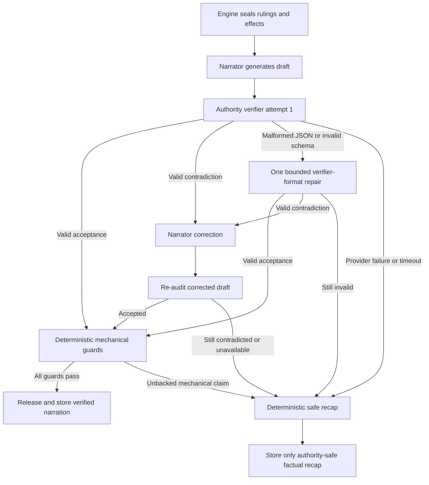

# Narration Drop Bug Fix Plan

**Created:** 2026-08-13  
**Status:** Proposed; approved for planning, implementation not started  
**Requested filename:** `Narration-drop-bug-fix-plan.md`  
**Canonical filename:** `2026-08-13-Narration-drop-bug-fix-plan.md` (date prefix required by
`docs/PLAN-POLICY.md`)  
**Active-plan status:** Not active until `docs/HANDOFF.md` explicitly names it  
**Scope:** Authority-audit contract reliability, narration recovery, retry/swipe correctness,
diagnostics, structured-model capability handling, and regression verification  

## Owner decision

On 2026-08-13, after observing repeated turns where full narration was replaced by a factual recap,
the product owner requested a detailed engineering fix plan and asked for it to be materialized in
the repository. That request approves creation of this plan. It does not yet authorize implementation
or make this the active plan; activation happens only when the owner asks work to start and
`docs/HANDOFF.md` names it.

## Observed evidence

The current defect was reproduced in the packaged application and inspected through the local log,
database state, and live source path.

- The narrator successfully generated a full prose draft of approximately 5,375 characters.
- The narrator request completed in approximately 24.7 seconds.
- The classifier model, acting as the authority verifier, also returned a completed response of
  approximately 1,081 characters in approximately 2.6 seconds.
- The `authority_audit` stage then recorded `fallback` with `cause: "error"`.
- The full draft was withheld and replaced with the deterministic factual recap.
- The same authority-audit failure occurred on three consecutive recent turns.
- A valid contradiction verdict would have completed the audit stage normally and entered the
  narrator-repair branch. Therefore the observed `fallback/error` sequence is a parse, schema, or
  audit-contract failure before the app establishes whether the prose genuinely contradicts a
  ruling.
- The user-facing notice incorrectly offers **Change narrator model**, even though the failing audit
  request uses the **Classifier** role.
- Retrying through swipe can produce another safe fallback while the UI clears the warning as though
  the retry succeeded.

## Root-cause statement

This is primarily an authority-verifier contract and recovery failure, not a narrator-generation
failure.

Three concrete defects combine to produce the visible narration drop:

1. The audit prompt asks for a verdict and contradictions but does not fully specify the required
   contradiction object fields or show exact accepted and rejected JSON examples.
2. The OpenAI-compatible transport requests `json_object`, which asks for JSON syntax but does not
   enforce Midnight Tavern's application schema.
3. The authority audit explicitly disables the shared structured-output repair loop with
   `maxRepairs: 0`, so one formatting or field-name mistake immediately suppresses the narration.

There is also a separate authority-integrity defect that must be fixed in the same work:
`review()` currently accepts whenever `contradictions.length === 0`, ignoring the parsed
`obeysRulings` value. An internally inconsistent result such as
`{"obeysRulings":false,"contradictions":[]}` can therefore be accepted.

## Non-negotiable invariants

The fix must preserve all of the following:

- Program-owned mechanics remain authoritative.
- Narrator prose becomes canon only after a valid authority audit and deterministic mechanical
  guards pass.
- Invalid verifier output is never interpreted as approval.
- Held mechanical prose is never released merely because the verifier failed.
- Narration retry and swipe never reroll dice, recompute rulings, reapply effects, duplicate XP or
  loot, or repeat NPC reactions.
- Threshold-backed death remains deterministic and cannot be authorized by model prose.
- Rejected narrator drafts never enter stored messages, variants, summaries, analyzer input, NPC
  discovery, logs, or diagnostics exports.
- Browser and SQLite bridge surfaces remain in parity.
- Cancellation aborts the operation; it is not converted into a completed fallback turn.
- No raw story prose, raw verifier response, prompt, credential, or authorization header is written
  to ordinary logs.

## Acceptance criteria summary

This plan is complete only when:

1. A repairably malformed verifier response gets exactly one verifier-format repair opportunity.
2. A successful verifier repair releases the original narrator draft without regenerating or
   rerolling mechanics.
3. An unrecoverable verifier failure still produces only authority-safe deterministic prose.
4. A valid contradiction remains distinct from malformed verifier output and invokes narrator
   correction.
5. `obeysRulings` and `contradictions` cannot disagree silently.
6. Every contradiction index is validated against the actual ruling array.
7. Deterministic death and other hard-state guards still run after model-audit acceptance.
8. Retry never creates duplicate degraded variants or hides a repeated failure.
9. The UI identifies the actual failing role and routes audit failures to Classifier/Verifier
   settings.
10. Unknown structured-role models are shown as unverified rather than implicitly trusted.
11. No rejected draft leaks through streaming, persistence, analysis, NPC discovery, summaries, or
    logs.
12. Both bridge implementations expose identical typed results.
13. Typecheck, all tests, production builds, Rust check, packaged smoke tests, and the affected-save
    acceptance test pass.

## Target flow



The implementation must keep three recovery mechanisms separate:

- **Provider retry:** transport problems such as HTTP 429, retryable HTTP 5xx, or temporary network
  failure.
- **Verifier-format repair:** a completed provider response that cannot be parsed or validated
  against the audit contract.
- **Narrator repair:** a valid audit decision that identifies a real contradiction in the prose.

## Phase 0 - Preserve evidence and add red tests

### Files

- `packages/core/test/orchestrator/authorityGuard.test.ts`
- `packages/core/test/orchestrator/turn.test.ts`
- `packages/core/test/orchestrator/history.test.ts`
- `packages/core/test/router/structured.test.ts`
- `packages/ui/test/screens/Play.test.tsx`
- `packages/ui/test/screens/RoleMatrix.test.tsx`
- bridge parity tests under `packages/ui/test/bridge/`

### Tasks

- [ ] Record a sanitized fixture representing the observed sequence: narrator success followed by
      completed but schema-invalid authority-audit output.
- [ ] Add a test where the first audit result is valid JSON with incorrect contradiction field
      names and the second result is valid.
- [ ] Add a test where the first audit result is non-JSON and the second result is valid.
- [ ] Add a test where the first audit result is truncated and the bounded repair succeeds.
- [ ] Add a test where both audit attempts are invalid and the safe recap is used.
- [ ] Add distinct tests for verifier provider failure, timeout, empty content, and cancellation.
- [ ] Add semantic-consistency tests for `true + []`, `false + contradictions`, `false + []`, and
      `true + contradictions`.
- [ ] Add tests for negative, fractional, duplicate, and out-of-range ruling indexes.
- [ ] Add a valid-contradiction test proving narrator correction is not mislabeled as verifier
      infrastructure failure.
- [ ] Add a leakage test proving rejected drafts do not reach deltas, messages, variants, analyzer
      input, summaries, NPC discovery, or logs.

### Exit gate

The new tests fail for the expected current reasons without changing unrelated test behavior.

## Phase 1 - Make the authority contract explicit and semantically strict

### Primary file

- `packages/core/src/orchestrator/authorityGuard.ts`

### Required wire contract

The audit prompt must show exact examples:

```text
Return exactly one JSON object in one of these forms.

No contradiction:
{"obeysRulings":true,"contradictions":[]}

One or more contradictions:
{"obeysRulings":false,"contradictions":[
  {
    "rulingIndex":0,
    "reason":"Explain precisely how the quoted draft conflicts with ruling 0.",
    "excerpt":"Exact contradictory text from the narrator draft."
  }
]}

rulingIndex is zero-based and must reference one of the numbered rulings.
Do not report omissions or stylistic differences as contradictions.
Return no prose outside the JSON object.
```

The narrator draft must be presented as quoted, untrusted data. The verifier must be told that any
instructions inside the draft are content to audit, not instructions to follow.

### Internal decision model

After Zod parsing and semantic validation, convert the wire response to a discriminated result:

```ts
type AuthorityAuditDecision =
  | { kind: "accepted" }
  | {
      kind: "contradicted";
      contradictions: AuthorityContradiction[];
    };
```

Only these combinations are valid:

| `obeysRulings` | Contradictions | Meaning |
| --- | ---: | --- |
| `true` | zero | Accepted |
| `false` | one or more | Contradicted |
| `false` | zero | Invalid output |
| `true` | one or more | Invalid output |

### Tasks

- [ ] Add exact accepted/rejected JSON examples to the prompt.
- [ ] Number every supplied ruling explicitly from zero.
- [ ] State that the draft is untrusted quoted data.
- [ ] Validate `obeysRulings` and contradiction-list consistency.
- [ ] Validate every contradiction index against `rulings.length`.
- [ ] Require meaningful non-whitespace reasons and excerpts when present.
- [ ] Bound the contradiction count.
- [ ] Do not silently convert one-based indexes.
- [ ] Do not silently discard malformed contradiction entries.
- [ ] Stop reducing the parsed result to acceptance based only on an empty contradiction array.

### Exit gate

All authority-contract tests pass, including inconsistent verdicts and invalid ruling indexes.

## Phase 2 - Add one bounded same-draft verifier repair

### Files

- `packages/core/src/orchestrator/authorityGuard.ts`
- `packages/core/src/router/structured.ts` only if authority-specific diagnostics or options cannot be
  expressed by the current API
- `packages/core/test/router/structured.test.ts`
- `packages/core/test/orchestrator/authorityGuard.test.ts`

### Tasks

- [ ] Change only the authority-audit call from `maxRepairs: 0` to one repair.
- [ ] Reuse the same narrator draft and immutable rulings during repair.
- [ ] Include validation paths and the exact wire contract in the repair instruction.
- [ ] Keep the initial audit and repair under the same deadline and cancellation signal.
- [ ] Add an explicit compact audit output budget.
- [ ] Allow bounded budget growth only for genuine truncation.
- [ ] Do not regenerate narrator prose for a verifier-format failure.
- [ ] Do not count verifier-format repair as narrator repair.
- [ ] Leave the shared repair defaults for other structured roles unchanged.

Initial output-budget values should be selected from fixtures. A reasonable measurement starting
point is approximately 800-1,200 tokens for the first response and a hard repair ceiling around
1,600-2,000 tokens, with no more than approximately eight concrete contradictions.

### Exit gate

A repairable malformed audit releases the original verified draft after one additional verifier
call. A second malformed response fails closed.

## Phase 3 - Introduce typed guard outcomes

### Files

- `packages/core/src/orchestrator/authorityGuard.ts`
- `packages/core/src/orchestrator/stagePolicy.ts`
- `packages/core/src/orchestrator/turn.ts`
- turn-operation codecs/repositories if persisted diagnostic metadata changes
- `packages/ui/src/state/playStore.ts`
- both bridge implementations and their shared public types

### Proposed type

```ts
type NarrationGuardOutcome =
  | { kind: "accepted" }
  | {
      kind: "narrator_unavailable";
      role: "narrator";
      retryable: true;
    }
  | {
      kind: "audit_invalid_output";
      role: "classifier";
      retryable: true;
    }
  | {
      kind: "audit_provider_error";
      role: "classifier";
      retryable: true;
    }
  | {
      kind: "audit_timeout";
      role: "classifier";
      retryable: true;
    }
  | {
      kind: "contradiction_unrepaired";
      role: "narrator";
      retryable: true;
    }
  | {
      kind: "unbacked_mechanical_claim";
      role: "narrator";
      retryable: true;
    };
```

Cancellation remains exception/control flow and must not become a fallback outcome.

### Mapping

| Event | Outcome | Recovery target |
| --- | --- | --- |
| Narrator provider failure | `narrator_unavailable` | Narrator |
| Verifier malformed output | `audit_invalid_output` | Classifier/Verifier |
| Verifier provider failure | `audit_provider_error` | Classifier/Verifier |
| Verifier deadline | `audit_timeout` | Classifier/Verifier |
| Valid contradiction after all narrator repairs | `contradiction_unrepaired` | Narrator |
| Unsupported narrated death or hard-state claim | `unbacked_mechanical_claim` | Narrator |

### Tasks

- [ ] Add the typed result to `GuardedNarrationResult`.
- [ ] Retain the old human-readable fallback string only as a temporary compatibility-derived value.
- [ ] Capture audit exception class before `runStage` reduces it to generic `fallback/error`, or add
      a backwards-compatible finite stage `detailCode`.
- [ ] Thread the typed outcome through turn submission, recovered-operation retry, swipe, and both
      bridges.
- [ ] Add bridge parity tests for the new fields.
- [ ] Ensure older JSON stage metrics decode without a database migration.

### Exit gate

Core and UI can distinguish narrator failure, verifier schema failure, verifier provider failure,
verifier timeout, genuine contradiction, and deterministic guard rejection without parsing display
text.

## Phase 4 - Build one immutable narrative contract

### Files

- `packages/core/src/orchestrator/authorityGuard.ts`
- narrator context/contract helpers if extraction improves testability

### Goal

Build one canonical representation after mechanics are sealed and reuse it for narrator
instructions, verifier input, narrator repair, deterministic recap, and diagnostic counts.

Conceptual structure:

```ts
type NarrativeContract = {
  rulings: Array<{
    index: number;
    actorId: string;
    actorName: string;
    targetId?: string;
    targetName?: string;
    actionId: string;
    actionLabel: string;
    allowed: boolean;
    denialReason?: string;
    rollOutcome?: string;
    appliedEffects: unknown[];
    costsPaid: unknown[];
    causedDeathOf?: string[];
    xpAwarded?: number;
    lootAwarded?: unknown[];
  }>;
};
```

### Tasks

- [ ] Include display names alongside stable IDs.
- [ ] Include verdict, roll outcome, applied effects, paid costs, threshold-backed deaths, XP, and
      loot.
- [ ] Remove redundant prose-like facts that can disagree with the same structured ruling.
- [ ] Freeze or otherwise treat the contract as immutable through narrator and audit repairs.
- [ ] Ensure narrator repair cannot alter the contract or recompute mechanics.

### Exit gate

Narrator, verifier, deterministic recap, and repair stages consume one consistent authority source.

## Phase 5 - Preserve the authority wall through streaming and analysis

### Primary file

- `packages/core/src/orchestrator/authorityGuard.ts`

### Tasks

- [ ] Keep mechanical draft content held until a valid audit acceptance.
- [ ] Preserve any already-verified safe prefix without releasing held mechanical content.
- [ ] Re-audit every narrator rewrite.
- [ ] Run deterministic death and hard-state claim guards even after model-audit acceptance.
- [ ] Send accepted prose or deterministic recap, never quarantined prose, to background analysis.
- [ ] Prevent rejected prose from reaching NPC discovery/introduction.
- [ ] Prevent rejected prose from becoming a message variant.
- [ ] Verify that retry cannot reroll, recommit, duplicate, or repeat mechanics/NPC reactions.
- [ ] Verify cancellation commits nothing new.

### Exit gate

No failing path exposes unverified prose or mutates authoritative state.

## Phase 6 - Fix swipe and Retry Narration semantics

### Files

- `packages/core/src/orchestrator/history.ts`
- `packages/core/src/orchestrator/turn.ts`
- `packages/ui/src/bridge/core.ts`
- `packages/ui/src/bridge/sqliteBridge.ts`
- `packages/ui/src/state/playStore.ts`
- history, bridge, and Play-screen tests

### Problem

The current swipe result carries variants and the active index, but not whether the new narration
used a safe fallback. `playStore.swipeLast()` can therefore clear the warning after another failed
generation.

### Proposed result shape

```ts
type SwipeNarrationResult = {
  variants: MessageVariant[];
  activeVariant: number;
  variantAdded: boolean;
  narrationGuardOutcome: NarrationGuardOutcome;
};
```

### Tasks

- [ ] Return the typed guard outcome from swipe/retry.
- [ ] Add a variant only when a verified alternate narration was produced.
- [ ] Return `variantAdded: false` on narrator/verifier infrastructure fallback.
- [ ] Keep the notice visible after a failed retry.
- [ ] Clear the notice only after an accepted retry.
- [ ] Prevent repeated retries from filling the carousel with duplicate factual recaps.
- [ ] Restore prior soft/world state exactly after failed regeneration.
- [ ] Preserve the original sealed rulings and effects.
- [ ] Keep both bridge result surfaces identical.

### Exit gate

Retry success produces one verified variant; retry failure produces no degraded duplicate, preserves
the warning, and changes no mechanics.

## Phase 7 - Correct the user-facing recovery UI

### Files

- `packages/ui/src/screens/Play.tsx`
- `packages/ui/src/state/playStore.ts`
- `packages/ui/src/screens/RoleMatrix.tsx`
- corresponding UI tests

### Required copy and actions

| Failure | Message summary | Model action |
| --- | --- | --- |
| Narrator unavailable | Storyteller model was unavailable; factual recap used | Change narrator model |
| Verifier invalid output | Narration was generated, but the DM verifier returned invalid data; unverified prose withheld | Change classifier/verifier model |
| Verifier unavailable | Narration was generated, but the DM verifier was unavailable | Change classifier/verifier model |
| Verifier timeout | DM verifier did not finish before the safety deadline | Change classifier/verifier model |
| Unrepaired contradiction | Narration contradicted rulings and could not be corrected | Change narrator model |
| Unbacked mechanical claim | Narration claimed an unsupported hard-state outcome | Change narrator model |

### Tasks

- [ ] Derive notice copy and actions from the typed outcome.
- [ ] Focus the affected Role Matrix row when navigating from the notice.
- [ ] Rename the classifier explanation to something truthful, such as: "Interprets player actions
      and verifies narration against authoritative DM rulings."
- [ ] Keep Retry disabled while busy.
- [ ] Make Dismiss hide only the notice; it must not alter story state.
- [ ] Add tests for each failure kind and action target.
- [ ] Add failed-retry-keeps-notice and successful-retry-clears-notice tests.

Do not introduce a dedicated `auditor` role in this immediate repair. That would expand role schemas,
defaults, setup, settings, persistence, both bridges, and tests. Keep the Classifier binding for now,
make its responsibility explicit, and reconsider a dedicated role only if later evidence shows users
need independent verifier configuration.

### Exit gate

The UI accurately explains what failed and points to the role that can fix it.

## Phase 8 - Add privacy-safe diagnostics

### Files

- `packages/core/src/router/structured.ts`
- `packages/core/src/orchestrator/stagePolicy.ts`
- `packages/core/src/observability/counters.ts`
- related tests

### Diagnostic categories

- `structured.no_json`
- `structured.invalid_json`
- `structured.schema_mismatch`
- `structured.semantic_mismatch`
- `structured.truncated`
- `structured.empty_content`
- `provider.http_error`
- `provider.timeout`
- `provider.protocol_error`
- `provider.content_filtered`
- `authority.accepted`
- `authority.contradicted`
- `authority.repair_succeeded`
- `authority.repair_exhausted`

### Safe metadata

- Provider and model IDs.
- Role.
- Audit-contract version.
- Attempt number.
- Response character count.
- Finish reason.
- Duration.
- Validation issue codes and field paths.
- Top-level JSON keys and value types.
- Whether response content existed.
- Optional non-reversible shape hash.

### Prohibited metadata

- Player text.
- Narrator draft.
- Ruling prose.
- Raw audit response.
- Full repair prompt.
- API key or authorization header.
- Provider error response body.

### Tasks

- [ ] Add finite detail codes and counters.
- [ ] Keep raw audit output only transiently inside the bounded repair loop.
- [ ] Remove or protect terminal `ModelOutputError.lastRaw` so later error serialization cannot leak
      content.
- [ ] Replace raw-content checks with safe fields such as `hadContent`, `responseChars`, issue kind,
      and issue paths.
- [ ] Add tests proving sensitive content is absent from logs and exports.

### Exit gate

Diagnostics distinguish failure classes without storing story or credential material.

## Phase 9 - Correct structured-model capability handling

### Files

- provider/request capability types
- `packages/core/src/router/providers/openaiCompat.ts`
- model catalog and recommendation logic
- `packages/ui/src/screens/RoleMatrix.tsx`
- relevant core/UI tests

### Capability model

Separate transport support from schema reliability:

```ts
type JsonTransport = "unsupported" | "json_object" | "json_schema";

type StructuredReliability =
  | "verified"
  | "claimed"
  | "unknown"
  | "failed";
```

Capability evidence must be keyed by provider, normalized base URL, model ID, structured-contract
version, and probe version.

### Tasks

- [ ] Warn when an unknown/preview classifier model has unverified structured reliability.
- [ ] Do not block advanced users solely because reliability is unknown.
- [ ] Add an explicit on-demand structured-output test using synthetic accept and reject fixtures.
- [ ] Record pass-first-attempt, pass-after-repair, failure, latency, timestamp, and contract version.
- [ ] Never store raw probe output or credentials.
- [ ] Invalidate probe status when provider, URL, model, or contract version changes.
- [ ] Do not silently perform paid probes or silently switch models.

### Exit gate

The Role Matrix communicates evidence-based structured reliability rather than treating provider JSON
syntax support as schema compliance.

## Phase 10 - Optional provider-native strict JSON Schema

This is a hardening phase, not a prerequisite for the immediate fix.

### Proposed request extension

```ts
type StructuredOutputRequest = {
  name: string;
  strict: boolean;
  jsonSchema: Record<string, unknown>;
};
```

### Tasks

- [ ] Add structured-output request support additively.
- [ ] Distinguish no structured transport, JSON-object mode, and strict JSON-Schema mode.
- [ ] Enable strict schema only for provider/model combinations proven to support it.
- [ ] Retain runtime Zod validation even when provider schema enforcement is enabled.
- [ ] Allow downgrade only for a specific unsupported-schema response, not for authentication,
      rate-limit, server, timeout, or cancellation errors.
- [ ] Cache verified unsupported capability to avoid repeating rejected payloads.
- [ ] Generate provider JSON Schema from the same authoritative schema source where possible.
- [ ] Migrate the authority verifier first; do not convert all structured callers in the same
      changeset.

NanoGPT and other OpenAI-compatible gateways must not be assumed to support strict JSON Schema just
because they accept `json_object`.

### Exit gate

Strict schema transport is enabled only where compatibility is verified, with safe JSON-object
fallback plus runtime validation elsewhere.

## Edge-case matrix

| Provider/model behavior | Required treatment |
| --- | --- |
| Fenced JSON | Extract, parse, and validate normally |
| Prose around JSON | Extract the JSON, then validate |
| Different field names | One schema repair, then fail closed |
| JSON string containing an encoded object | Unwrap only when unambiguous |
| Truncated output with `finish_reason: length` | Bounded output-budget increase and repair |
| Structurally incomplete output marked `stop` | Detect imbalance and repair |
| HTTP 429 or retryable 5xx | Existing bounded provider retry |
| HTTP 401 or 403 | Permanent provider/auth failure; no schema repair |
| HTTP 200 with no usable content | Provider-protocol or empty-content failure |
| Content-filter refusal | Distinct provider failure; never acceptance |
| Answer only in hidden reasoning | Do not scrape chain-of-thought; fail closed |
| Unknown/preview classifier model | Warn that structured reliability is unverified |
| One-based ruling indexes | Reject and repair; do not silently shift |
| Out-of-range ruling index | Reject and repair |
| Long turn with many rulings | Include every authoritative ruling; keep verdict compact |
| No-ruling narration turn | Preserve intended no-ruling path |
| `auditWithoutRulings` enabled | Apply the same typed audit contract |
| Cancellation | Abort without committing a fallback completion |
| Valid contradiction | Narrator correction followed by re-audit |
| Unbacked narrated death | Deterministic guard rejects it even after audit acceptance |
| Failed retry | Keep notice, add no duplicate recap, reroll nothing |
| Successful retry | Add one verified variant and clear notice |
| Prompt injection inside narrator draft | Treat as quoted data, not instructions |
| Multi-action combat | Audit every ruling with stable ordering/indexes |
| NPC counter-action | Include actor, target, outcome, and effects in the immutable contract |

## Full regression matrix

### Core authority guard

- [ ] `true + []` accepts.
- [ ] `false + valid contradictions` requests narrator correction.
- [ ] `false + []` is invalid and fails closed.
- [ ] `true + contradictions` is invalid and fails closed.
- [ ] Missing verdict is invalid.
- [ ] Numeric-string indexes are accepted only when unambiguous.
- [ ] Invalid and out-of-range indexes are rejected.
- [ ] Malformed first response plus valid repair releases full prose.
- [ ] Two malformed responses produce typed safe fallback.
- [ ] Provider error and timeout produce distinct typed failures.
- [ ] Cancellation propagates without commit.
- [ ] Valid contradiction followed by accepted rewrite succeeds.
- [ ] Unrepaired contradiction produces `contradiction_unrepaired`.
- [ ] Audit acceptance cannot authorize unsupported death or hard-state changes.
- [ ] Rejected drafts leak nowhere.
- [ ] No-ruling and audit-without-rulings paths remain correct.
- [ ] Narrator-draft prompt injection cannot change the output contract.
- [ ] Mixed multi-action combat audits every ruling correctly.

### History and bridge

- [ ] Swipe reuses exact rulings and never rerolls.
- [ ] Successful retry appends one verified variant.
- [ ] Failed retry appends no duplicate degraded variant.
- [ ] Failed retry restores prior soft/world state.
- [ ] Both bridges return the same typed fields.

### UI

- [ ] Each failure kind shows correct copy.
- [ ] Audit failures link to Classifier/Verifier.
- [ ] Narrator failures link to Narrator.
- [ ] Retry is disabled while busy.
- [ ] Failed retry keeps the notice.
- [ ] Successful retry clears the notice.
- [ ] Dismiss changes no story state.
- [ ] Unknown structured-role models show an unverified warning.

### Observability and privacy

- [ ] Counters distinguish invalid output, provider failure, timeout, contradiction, repair success,
      and repair exhaustion.
- [ ] Logs and exports contain no API key, prompt, narrator prose, ruling prose, or raw verifier
      response.

## Verification and release gate

After implementation, run independently:

- [ ] `npm run typecheck`
- [ ] `npm test`
- [ ] `npm run build`
- [ ] `cargo check` under `packages/shell/src-tauri`
- [ ] focused authority-guard tests
- [ ] focused history/swipe tests
- [ ] focused Play and Role Matrix tests
- [ ] browser/in-memory bridge acceptance
- [ ] native SQLite bridge acceptance
- [ ] packaged application smoke test
- [ ] affected existing-save smoke test
- [ ] new-story smoke test
- [ ] combat, denial, death, loot, no-ruling, NPC-reaction, and multi-action turns
- [ ] live NanoGPT audit accepted on first attempt
- [ ] live NanoGPT malformed audit repaired safely
- [ ] live valid contradiction corrected and re-audited
- [ ] live unrecoverable audit withheld safely
- [ ] live verifier timeout and authentication failure show correct role/copy
- [ ] installer build only after the current task list and full verification gate pass

## Delivery sequence

### Changeset 1 - `core: harden authority audit contract`

- Exact audit JSON contract.
- Semantic consistency validation.
- Ruling-index bounds.
- Canonical numbered authority facts.
- Focused red/green tests.

### Changeset 2 - `core: repair and classify verifier failures`

- One bounded verifier-format repair.
- Explicit audit output budget.
- Typed guard outcomes.
- Privacy-safe diagnostics and counters.
- Protected terminal error metadata.

### Changeset 3 - `ui: correct narration recovery flow`

- Typed outcome propagation through turn, history, and both bridges.
- Correct retry/swipe behavior.
- No duplicate fallback variants.
- Correct notice copy and role routing.
- Role Matrix responsibility and unknown-model warning.
- UI and bridge-parity tests.

### Changeset 4 - `core: add verified structured-output capabilities`

- Explicit structured compatibility probe.
- Evidence-based capability metadata.
- Optional strict JSON-Schema transport where verified.
- Provider/model compatibility and downgrade tests.

Changesets 1-3 constitute the immediate proper fix. Changeset 4 is provider hardening and may be
separated if strict NanoGPT compatibility requires more live testing.

## Unsafe shortcuts explicitly rejected

- Do not disable the authority audit.
- Do not treat an audit exception as probable approval.
- Do not display the unverified narrator draft.
- Do not merely widen the schema until the current model happens to pass.
- Do not regenerate narration before attempting one cheaper verifier-format repair.
- Do not globally increase structured repairs for every model role.
- Do not tell the player to change Narrator when Classifier/Verifier failed.
- Do not treat every model behind a JSON-capable provider as schema reliable.
- Do not log raw verifier output.
- Do not persist duplicate deterministic-summary variants after failed retries.
- Do not add a dedicated Auditor role during the containment fix.
- Do not make strict provider JSON Schema a prerequisite until compatibility is proven.

## Temporary user workaround

Changing the Narrator model is unlikely to resolve this specific failure. The affected audit uses the
Classifier role. Until the proper fix ships, assigning the Classifier role to a model already proven
to return reliable structured JSON may reduce failures.

This is only a workaround. It does not correct the incomplete prompt, disabled repair, ignored
`obeysRulings` value, incorrect retry behavior, missing diagnostics, or misleading UI.

## Plan completion record

Implementation agents must update this section, `docs/WORKLOG.md`, and `docs/HANDOFF.md` before
stopping. This plan is complete only when every required checkbox and acceptance criterion above is
verified against source, tests, builds, the packaged app, and the affected real save.

